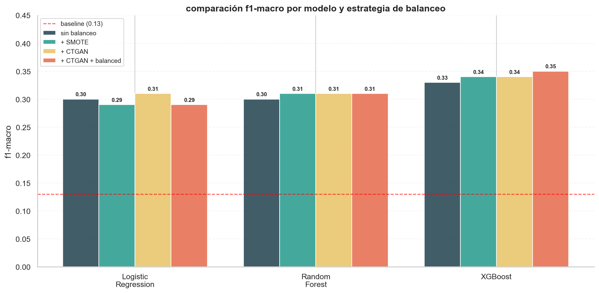

# Comparación Rigurosa de Técnicas de Balanceo de Clases: SMOTE vs. CTGAN en Clasificación Multiclase con Desbalance Extremo

> **CTGAN no superó a SMOTE en ninguna de las tres arquitecturas evaluadas.** El balanceo no resolvió la clase minoritaria — los datos sintéticos solo añaden valor cuando el problema es de volumen, no de separabilidad. Este proyecto documenta cuándo la técnica sofisticada no aporta sobre la simple.

---

## Problema central

Cuando una clase minoritaria representa apenas el 1.68% del dataset, el instinto inicial es generar datos sintéticos para balancearla. Pero ¿realmente mejora el clasificador? ¿La calidad estadística de un GAN supera a la interpolación lineal de SMOTE? ¿Y si el problema no es la cantidad de datos sino la información disponible?

Este proyecto responde esas preguntas con un experimento controlado: **tres clasificadores × cuatro estrategias de balanceo = doce evaluaciones comparables** sobre datos reales de salud pública estadounidense. La pregunta no es "¿qué F1 alcanzo?" sino "¿qué técnica de balanceo justifica su complejidad?"

---

## Por qué importa este experimento

CTGAN es uno de los modelos generativos más populares para datos tabulares y se usa rutinariamente para balanceo de clases en producción — desde fraude bancario hasta diagnóstico clínico. Pero los benchmarks que evalúan su impacto downstream son escasos y a menudo cherrypicked. Este proyecto aporta evidencia honesta sobre cuándo CTGAN aporta valor real y cuándo no.

El hallazgo principal — que CTGAN no superó a SMOTE — replica conclusiones del [Proyecto 00 (CTGAN Critical Evaluation)](https://github.com/pabdus/ctgan-adult-critical-evaluation), donde V3b (clip-only, una línea de código) superó a V2 (log+clip, mucho más elaborado) en utilidad downstream. La narrativa es coherente: **la técnica simple a veces gana, y documentar cuándo el método sofisticado no aporta valor es tan importante como documentar cuándo sí lo hace.**

---

## Datos

| Fuente | Descripción | Tamaño |
|--------|-------------|--------|
| [CDC BRFSS 2023](https://www.cdc.gov/brfss/annual_data/annual_2023.html) | Behavioral Risk Factor Surveillance System | 433,323 encuestados, 345 variables |

**Dataset final tras limpieza:** 289,693 registros × 12 variables. Se excluyeron condiciones crónicas (diabetes, hipertensión) por causalidad inversa con la obesidad, y módulos opcionales con >48% de nulos por sesgo geográfico (no todos los estados aplicaron las mismas preguntas).

**Distribución del target — desbalance documentado:**

| Categoría IMC | Registros | Proporción |
|---------------|-----------|------------|
| Bajo peso | 5,835 | **1.68%** |
| Normal | 85,648 | 29.56% |
| Sobrepeso | 103,003 | 35.56% |
| Obesidad | 96,207 | 33.21% |

---

## Diseño experimental

**Tres clasificadores:** Logistic Regression (lineal, baseline metodológico), Random Forest (ensemble paralelo), XGBoost (boosting secuencial).

**Cuatro estrategias de balanceo:**
1. **Sin balanceo** — referencia de comparación
2. **SMOTE** — interpolación lineal entre vecinos hasta balanceo completo (83,233 por clase)
3. **CTGAN** — 10,000 muestras sintéticas de `bajo_peso` (balanceo parcial deliberado)
4. **CTGAN + class_weight balanced** — combinación de aumento sintético y reponderación

**Decisión metodológica crítica — balanceo parcial con CTGAN:** con solo 879 casos reales de `bajo_peso` en train, generar 83,000 sintéticos para igualar la clase mayoritaria habría garantizado memorización del generador y mode collapse — exactamente el riesgo identificado en el Proyecto 00. La estrategia conservadora (10,000 muestras = ratio 11:1) busca añadir señal sin destruir diversidad estadística.

**Codificación diferenciada por modelo:** One-Hot para Logistic Regression, Ordinal Encoding con orden lógico para árboles. Decisión respaldada por benchmarks recientes (NeurIPS 2023, arXiv 2024) que demuestran que target encoding sería óptimo para árboles pero introduce data leakage si no se implementa dentro de validación cruzada anidada.

**Métrica principal:** F1-macro. El accuracy es engañoso bajo desbalance — un modelo que prediga siempre `sobrepeso` alcanza 35.6% de accuracy ignorando completamente las otras clases.

---

## Resultados

### Tabla comparativa — F1-macro por estrategia

| Modelo | Sin balanceo | + SMOTE | + CTGAN | + CTGAN + balanced |
|--------|-------------|---------|---------|-------------------|
| Baseline (clase mayoritaria) | 0.13 | — | — | — |
| Logistic Regression | 0.30 | 0.29 | 0.31 | 0.29 |
| Random Forest | 0.30 | 0.31 | 0.31 | 0.31 |
| **XGBoost** | **0.33** | **0.34** | **0.34** | **0.35** |

### F1-score específico para `bajo_peso` — la clase crítica

| Modelo | Sin balanceo | + SMOTE | + CTGAN | + CTGAN + balanced |
|--------|-------------|---------|---------|-------------------|
| Logistic Regression | 0.06 | 0.05 | 0.00 | 0.04 |
| Random Forest | 0.03 | 0.03 | 0.03 | 0.02 |
| XGBoost | 0.06 | 0.02 | 0.01 | **0.07** |

---

## Cinco hallazgos clave

### 1. CTGAN no superó a SMOTE en F1-macro

Las diferencias son marginales (±0.01) en todas las arquitecturas. La complejidad computacional adicional de entrenar un GAN durante 200 épocas no se justifica para este problema específico. **Implicación práctica:** antes de invertir en modelos generativos para balanceo, vale la pena confirmar que SMOTE realmente está dejando valor sobre la mesa.

### 2. El problema de `bajo_peso` es de separabilidad, no de volumen

Ninguna estrategia de balanceo elevó el F1 de `bajo_peso` por encima de 0.07. Los predictores disponibles — demografía, hábitos, nivel socioeconómico — no capturan los factores determinantes del bajo peso en adultos. Sin variables clínicas (historial médico, condiciones gastrointestinales, indicadores nutricionales), ningún clasificador ni técnica de balanceo puede discriminar esa clase de forma confiable. **El balanceo no inventa información que no existe en los datos.**

### 3. CTGAN evidenció dificultad para generar la clase minoritaria condicionalmente

Al solicitar 10,000 muestras condicionadas a `bajo_peso`, el Conditional Generator solo entregó 466 en el primer intento. Tomó 4 iteraciones y 200,000 muestras totales generadas para completar 10,000 de la clase objetivo. Tasa de generación: ~6%, contra el 1.68% natural — el modelo aprendió la condición pero no completamente. Con menos datos reales, el conditional sampling se vuelve poco confiable.

### 4. `class_weight="balanced"` produce overprediction masiva en Logistic Regression

La regresión logística con `balanced` alcanzó recall 0.46 en `bajo_peso` pero precision de apenas 0.03 — generó 13,228 predicciones de esa clase, de las cuales solo 408 eran correctas. **Trade-off documentado:** el balanceo agresivo en modelos lineales detecta más casos reales pero genera falsos positivos masivos. La utilidad de esta combinación depende del costo relativo de falsos positivos vs falsos negativos en el dominio.

### 5. XGBoost domina en todas las configuraciones

Con F1-macro entre 0.33 y 0.35, XGBoost supera consistentemente a Random Forest y Logistic Regression. La construcción secuencial de árboles que corrigen errores residuales captura mejor las fronteras no lineales entre `sobrepeso` y `obesidad` — donde Random Forest y Logistic Regression confunden masivamente.

---

## Visualización del hallazgo principal



*Las cuatro estrategias de balanceo producen F1-macro estadísticamente equivalentes (±0.02) para los tres clasificadores. La complejidad adicional de CTGAN no se traduce en mejora downstream.*

---

## Trade-offs documentados

| Técnica | Ventaja | Costo |
|---------|---------|-------|
| Sin balanceo | Simple, rápido, interpretable | Ignora `bajo_peso` casi completamente |
| SMOTE | Balanceo completo, rápido | Interpolación lineal pierde correlaciones complejas |
| CTGAN | Aprende distribución conjunta | 200 épocas de entrenamiento, no supera a SMOTE |
| class_weight balanced | Sin datos adicionales | Overprediction masiva en clase minoritaria |

---

## Conexión con el Proyecto 00

Este proyecto extiende metodológicamente el [Proyecto 00 (CTGAN Critical Evaluation)](../proyecto-00-ctgan-evaluation/) en una dirección complementaria. Mientras el P00 evaluó la calidad intrínseca de los datos sintéticos generados por CTGAN — fidelidad, utilidad, privacidad — el P02 evalúa su **impacto downstream en una tarea de clasificación real**.

Las conclusiones convergen: **la sofisticación del modelo generativo no se traduce automáticamente en mejor rendimiento downstream**. En el P00, V3b (clip-only) superó a V2 (log+clip) en TSTR pese a ser una línea de código vs un pipeline elaborado. En el P02, SMOTE iguala o supera a CTGAN pese a ser una técnica de 2002 vs un GAN de 2019. La lección es la misma: medir, comparar, documentar honestamente.

---

## Instalación y uso

```bash
git clone https://github.com/pabdus/proyecto-02-obesidad-brfss.git
cd proyecto-02-obesidad-brfss

python -m venv venv
venv\Scripts\activate          # Windows
# source venv/bin/activate     # Linux/Mac

pip install -r requirements.txt
```

**Datos:** descargar LLCP2023.XPT desde [CDC BRFSS 2023](https://www.cdc.gov/brfss/annual_data/annual_2023.html) y colocar en `data/raw/`.

```bash
jupyter notebook notebooks/01-eda.ipynb       # análisis exploratorio
jupyter notebook notebooks/02-modeling.ipynb  # pipeline de clasificación
```

**Tiempo estimado:** EDA ~5 min, entrenamiento de los tres modelos sin balanceo ~10 min, CTGAN 200 epochs ~60 min en CPU.

---

## Trabajo futuro

**Incorporar variables clínicas del BRFSS** — el módulo de condiciones crónicas tiene información sobre cáncer, enfermedades gastrointestinales y otras patologías que podrían discriminar mejor `bajo_peso`. Requiere abordar la causalidad inversa con cuidado.

**Evaluar TVAE como alternativa a CTGAN** — los Variational Autoencoders Tabulares son más estables en entrenamiento y podrían generar muestras de mayor diversidad para clases minoritarias.

**Ajuste de umbral de decisión** — independientemente del balanceo, mover el threshold de clasificación para `bajo_peso` permite explorar el trade-off precision-recall sin retraining. Probablemente el camino más eficiente para mejorar la detección de esa clase.

**Extender análisis a datos latinoamericanos** — cuando dispongamos de encuestas comparables al BRFSS para Colombia o México (la ENSIN, por ejemplo), replicar el experimento permitirá validar si los hallazgos generalizan a poblaciones con diferente distribución de IMC.

---

## Estructura del proyecto

```
proyecto-02-obesidad-brfss/
├── README.md
├── requirements.txt
├── .gitignore
├── data/
│   ├── raw/               ← LLCP2023.XPT (no incluido en repo)
│   └── processed/         ← brfss_2023_cleaned.csv
├── notebooks/
│   ├── 01-eda.ipynb       ← análisis exploratorio completo
│   └── 02-modeling.ipynb  ← clasificación + balanceo + comparación
└── reports/
    └── figures/           ← visualizaciones clave
```

---

## Autor

**Pablo Alberto Duque Marín**
- Ciencia de Datos — Universidad Compensar (4° semestre)
- Maestría en Estadística Aplicada — Universidad Cuauhtémoc, México
- Maestría en Inteligencia Artificial — UNIR, España
- Tesis activa: Explainable AI (XAI) con SHAP y LIME sobre datos clínicos

---

*Proyecto 02 del [Portafolio de Data Science](../README.md) — Abril 2026*
